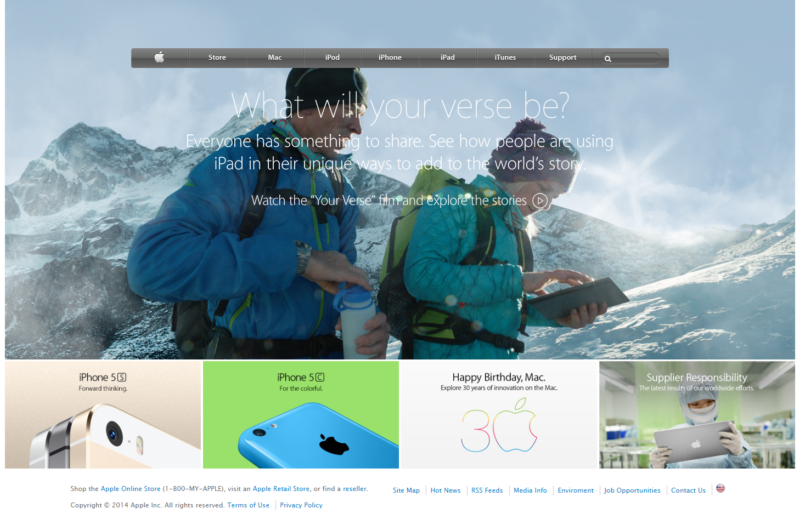

# Apple clone

> A clone of an old [Apple](https://web.archive.org/web/20140301004610/http://www.apple.com/) page.

This project consisted of building the [Apple](https://web.archive.org/web/20140301004610/http://www.apple.com/) webpage using images as a background and adding gradients to the nav bar. 

## Built With

- HTML
- CSS

## Live Demo

[https://fivan18.github.io/apple-clone/](https://fivan18.github.io/apple-clone/)

## Getting Started

**Download this project and use your favorite web brower to open the index.html to see how it looks like.**

## Authors

👤 **Ivan Ulises Guzman Sanchez**

- Github: [@fivan18](https://github.com/fivan18)
- Twitter: [@fivanunam](https://twitter.com/fivanunam)
- Linkedin: [fivan](www.linkedin.com/in/fivan)

## 🤝 Contributing

Contributions, issues and feature requests are welcome!

Feel free to check the [issues page](https://github.com/fivan18/apple-clone/issues).

